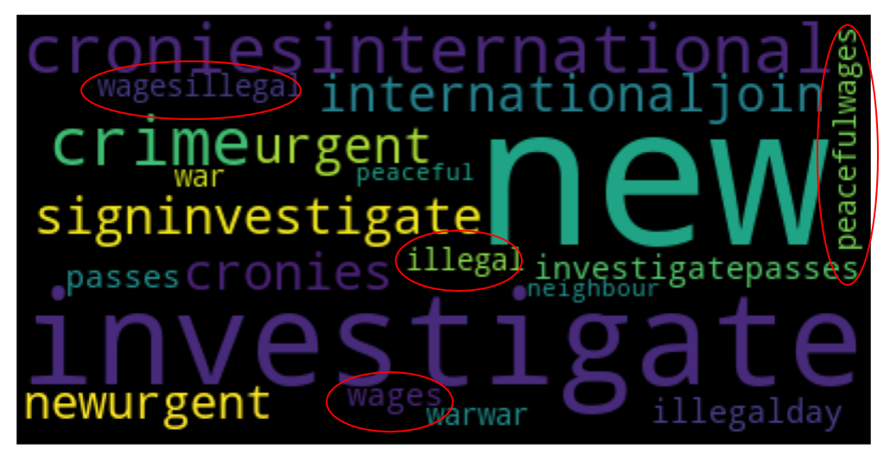
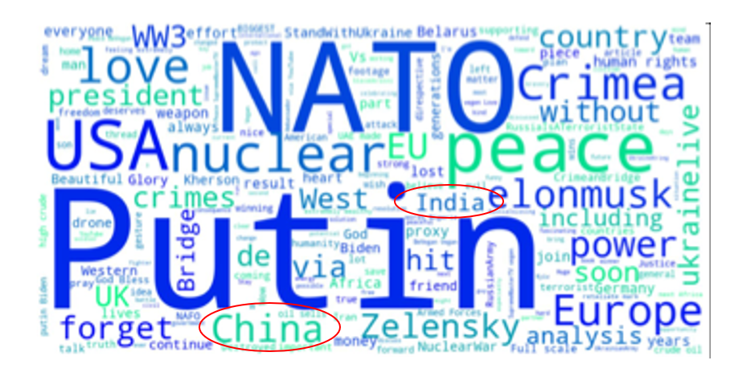

# Sentiment Analysis of social media posts on Russia-Ukraine war

## Introduction
Sentiment computation on social media posts on the war of Russia and Ukraine is done and key factors/reasons/topics are identified to determine how Ukraine is perceived on the International scene and suggest actions that could improve Ukraine's image.

## 1. Data collection and pre-processing
Tweets from this date to that date are scraped with the hash tag of #UkrainWar #RussiaWar and which is cleaned and computable data is prepared using TF-IDF.  
## 2. Sentiment Modelling 
Four different classification models are built and trained on the tweets that have had their sentiments already analyzed. 
- Logistic Regression
* Decision Trees
+ SVM
+ Random Forest
+ XGBoost

  

## 3. Sentiment Classification 
The trained models are used to classify the texts collected. Also, pretrained model AWS, Bard and all are also applied to make the classification. and then the majority of the predictions are taken as final sentiment.

  

## 4. Factor and Topics Identification
Based on the sentiment analysis results, factors, reasons and topics are identified that drive sentiment. 

  

  

## 5. Visualisations, story telling, recommendations
Visualisations of results obtained in part 3 and 4 with word clouds to show the public sentiment about Ukraine, sentiment about Russia. 

These results are used to make suggestions that can make positive impact on Ukraine's international presence and image. 
 

